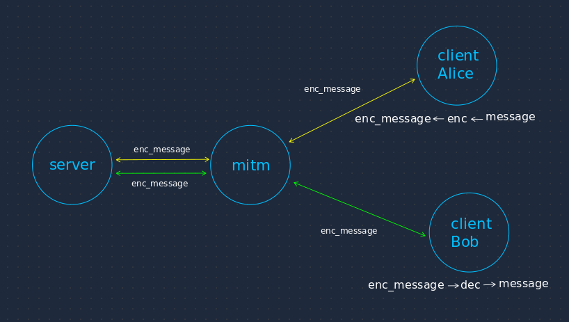

# Cryptography Simulation
- Caesar Cipher
- Substitution Cipher
- Vignere Cipher

This simulation uses simple socket communication.



## Choose an encryption technique
```python
# client.py
cipher_suite = CaesarCipher() | SubstitutionCipher() | VignereCipher()
```

## Run
*Run each command in parallel*

### Run Server
`python3 server.py`

### Run MITM
`python3 mitm.py`

### Run Client
`python3 client.py <Client_name>`

*ex: python3 client.py Bob*
